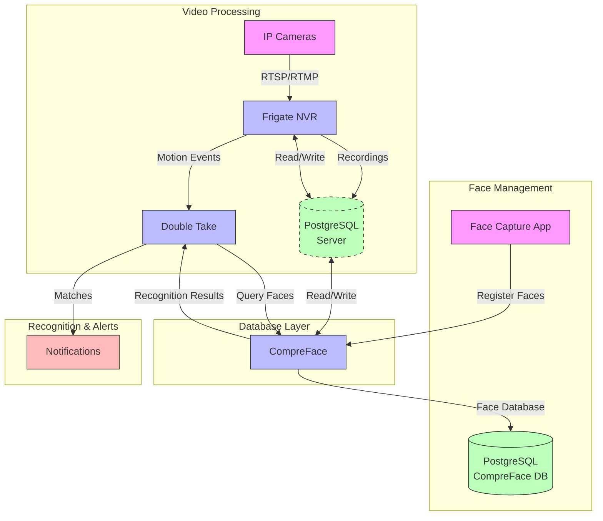

# Frigate NVR with Facial Recognition System

This project provides a comprehensive video surveillance and facial recognition system using Docker containers. It combines multiple open-source tools to create a powerful and customizable security solution.

## System Architecture

The system is composed of several interconnected modules, each serving a specific purpose in the video processing and facial recognition pipeline.

### Integration Diagram



### Diagram Explanation

1. **Video Processing Flow (Pink & Blue)**
   - IP cameras stream video to Frigate NVR
   - Frigate processes the video for motion and object detection
   - Motion events are sent to Double Take for face recognition
   - Recordings are stored in persistent storage

2. **Face Management (Pink & Blue)**
   - Face Capture App allows registering new faces
   - CompreFace manages the face database and recognition
   - Face data is stored in PostgreSQL

3. **Recognition & Alerts (Blue & Red)**
   - Double Take coordinates between Frigate and CompreFace
   - Face recognition results are processed by Double Take
   - Matches trigger notifications or other actions

## Core Modules

### 1. PostgreSQL Database
- **Purpose**: Centralized data storage for the entire system
- **Features**:
  - Separate databases for Frigate and CompreFace
  - Secure user access controls
  - Persistent storage for recordings and face data
  - Automated backups and maintenance
- **Port**: 5432 (Internal)
- **Databases**:
  - `frigate_db`: Stores video recordings and event data
  - `compreface_db`: Stores face recognition data and models

### 2. Frigate NVR
- **Purpose**: Real-time object detection and video recording
- **Features**:
  - Motion detection
  - Object detection (people, vehicles, animals, etc.)
  - 24/7 recording with AI-based event filtering
  - Hardware acceleration support (Intel QuickSync, NVIDIA, Coral TPU)
  - PostgreSQL integration for event and recording storage
- **Port**: 5001 (Web UI)

### 3. CompreFace
- **Purpose**: Face recognition and management
- **Features**:
  - Face detection and recognition
  - Face collection and management
  - REST API for integration
  - Web interface for administration
  - PostgreSQL integration for face data storage
- **Port**: 8000 (Web UI)

### 3. Face Capture App
- **Purpose**: Web interface for capturing and registering new faces
- **Features**:
  - Real-time camera feed
  - Face capture and storage
  - Integration with CompreFace for face registration
- **Port**: 5002 (Web UI)

### 4. Double Take
- **Purpose**: Face recognition integration layer
- **Features**:
  - Connects Frigate with CompreFace
  - Manages face matching and alerts
  - Provides a unified API for face recognition
  - Works with the shared PostgreSQL infrastructure
- **Port**: 3000 (Web UI)

## Prerequisites

- Docker and Docker Compose installed
- (Optional) Coral USB Accelerator for better performance
- RTSP/RTMP compatible IP camera(s)
- At least 4GB RAM (8GB recommended)
- x86_64 or ARM64 architecture

## Directory Structure

```
frigate-demo/
├── config/                 # Configuration files
│   ├── config.yml          # Frigate configuration
│   └── double-take/        # Double Take configuration
├── storage/                # Frigate recordings and snapshots
├── media/                  # Media storage
│   └── known_faces/       # Known face images for training
├── compreface-data/        # CompreFace database and models
└── face-capture/           # Face capture application
    ├── app.py             # Flask application
    ├── requirements.txt   # Python dependencies
    ├── static/           # Static files (JS, CSS)
    └── templates/        # HTML templates
```

## Getting Started

1. **Clone the repository**
   ```bash
   git clone <repository-url>
   cd frigate-demo
   ```

2. **Configure your cameras**
   - Edit `config/config.yml` to add your camera RTSP/RTMP streams
   - Configure detection zones and other Frigate settings

3. **Start the services**
   ```bash
   docker-compose up -d
   ```

4. **Access the web interfaces**
   - Frigate UI: http://localhost:5001
   - CompreFace: http://localhost:8000
   - Face Capture: http://localhost:5002
   - Double Take: http://localhost:3000

## Usage

### Adding New Faces
1. Open the Face Capture app (http://localhost:5002)
2. Enter the person's name
3. Capture their face using the web interface
4. The face will be automatically registered with CompreFace

### Viewing Recordings
1. Access the Frigate UI (http://localhost:5001)
2. Navigate to the "Events" tab
3. Filter by camera, object type, or time range

## Configuration

### Frigate
Edit `config/config.yml` to:
- Add/remove cameras
- Configure detection settings
- Set up recording and snapshots
- Configure hardware acceleration

### CompreFace
Access the web UI at http://localhost:8000 to:
- Manage face collections
- Configure recognition settings
- View recognition logs

## Troubleshooting

1. **No video feed**
   - Verify camera RTSP/RTMP URLs
   - Check if the camera is accessible from the Docker host

2. **Face recognition not working**
   - Ensure CompreFace is running and accessible
   - Verify faces are properly registered in CompreFace
   - Check Double Take logs for errors

3. **Performance issues**
   - Enable hardware acceleration in Frigate config
   - Consider using a Coral TPU for better performance
   - Allocate more CPU/RAM to Docker if needed

## Security Considerations

- Change default passwords and API keys
- Use HTTPS in production
- Restrict access to the web interfaces using a reverse proxy with authentication
- Keep Docker and all components updated

## License

This project is open source and available under the [MIT License](LICENSE).

## Contributing

Contributions are welcome! Please open an issue or submit a pull request.

## Support

For support, please open an issue in the GitHub repository.
└── compreface-data/        # CompreFace data and models
```

## Setup Instructions

1. **Configure Your Camera**
   - Update `config/config.yml` with your camera's RTSP URL and credentials
   - Test your camera feed with VLC or similar player

2. **Start the Services**
   ```bash
   docker-compose up -d
   ```

3. **Access the Web UIs**
   - Frigate: http://localhost:5001 (changed from 5000)
   - Double Take: http://localhost:3000
   - CompreFace: http://localhost:8000

4. **Configure CompreFace**
   - Open CompreFace UI
   - Create a new application (e.g., "Home Security")
   - Create a new face collection (e.g., "Family")
   - Note the API key for Double Take configuration

5. **Configure Double Take**
   - Open Double Take UI
   - Go to Settings → Faces
   - Add CompreFace as a face recognition service
   - Enter your CompreFace API key and collection name

6. **Add Known Faces**
   - Place face images in `media/known_faces`
   - Use the CompreFace UI to train the model with these images

## Updating Configuration

After making changes to `config.yml`, restart Frigate:
```bash
docker-compose restart frigate
```

## Troubleshooting

Check container logs:
```bash
docker-compose logs -f frigate
docker-compose logs -f double-take
docker-compose logs -f compreface
```

## Performance Tips

1. For better performance, uncomment the Coral TPU section in both `docker-compose.yml` and `config.yml`
2. Adjust detection FPS and resolution based on your hardware
3. Use motion masks to reduce false detections
4. Set up zones to focus on important areas

## Security Note

- Change all default passwords
- Don't expose the web interfaces to the internet without proper authentication
- Keep your system updated
